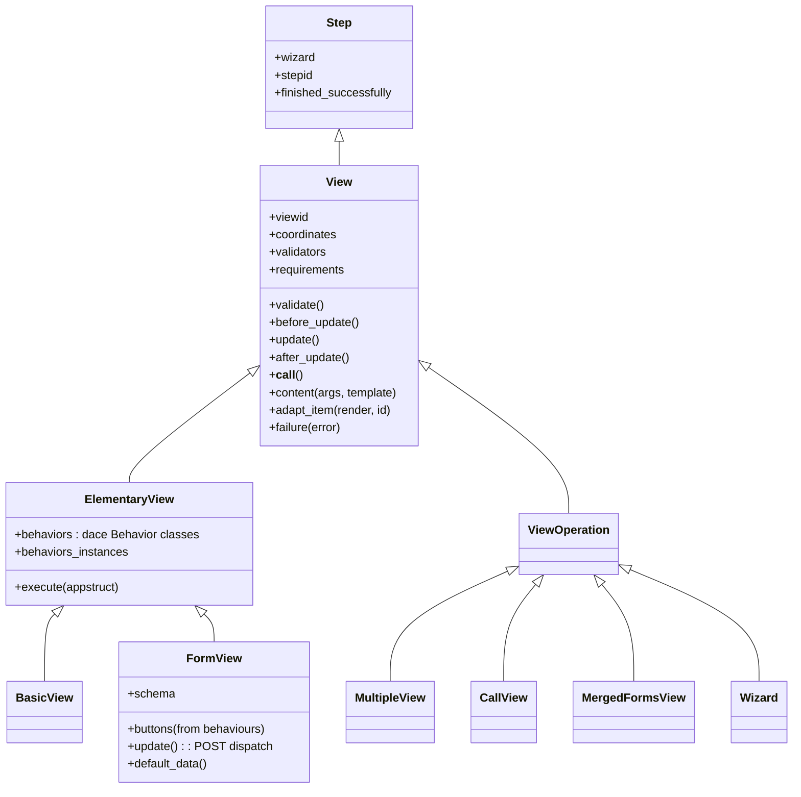
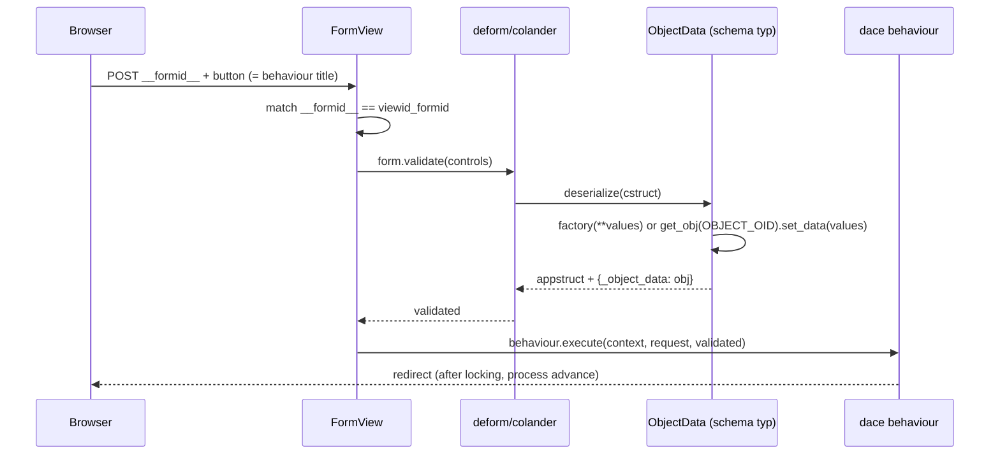

# Pontus — architecture and design

*Design document, Phase 2 of the modernisation roadmap. Describes the layer **as it is** in the legacy code base (Python 3.6 era). French version: [`../fr/architecture.md`](../fr/architecture.md).*

## 1. What Pontus is

Pontus is the **presentation layer of the dace stack**: it turns dace business actions into deform forms and Pyramid views, composes views into pages, and renders the navigation an object offers. Its founding idea mirrors the engine's: *a form's submit buttons are the business actions themselves*. A `FormView` declares a schema and a list of dace behaviours; pontus instantiates the behaviours (through the same catalog discovery the engine uses), generates **one submit button per behaviour instance**, validates the posted form, and hands the validated appstruct to `behavior.execute` — locking, process advancement and redirect included. Nothing in the host application wires buttons to handlers by hand.

The second founding idea is the **result contract**: every view returns `{'coordinates': {<slot>: [items]}, 'js_links': [...], 'css_links': [...]}` and results compose by deep merge (`util.merge_dicts`), which is what makes the composition algebra of section 4 possible.

## 2. The pieces

```mermaid
flowchart TB
    DACE["dace<br/>business actions, validators, catalog discovery"]
    VIEW["pontus.view<br/>View lifecycle, ElementaryView (behaviours), BasicView"]
    FORM["pontus.form<br/>FormView: one submit button per behaviour"]
    SCHEMA["pontus.schema + pontus.file.ObjectData<br/>colander &#8596; domain-object bridge, schema algebra"]
    WIDGET["pontus.widget<br/>oid-aware selects, sequences, files/images, resources"]
    OPS["pontus.view_operation<br/>MultipleView, CallView, MergedFormsView, Wizard"]
    NAV["pontus.index + pontus.panels<br/>index page and navbar from the actions"]
    HOST["Host app (nova-ideo)<br/>schemas + views + DEFAULTMAPPING_ACTIONS_VIEWS"]

    HOST --> FORM
    HOST --> OPS
    NAV --> DACE
    VIEW --> DACE
    FORM --> VIEW
    FORM --> SCHEMA
    SCHEMA --> WIDGET
    OPS --> FORM
    OPS --> VIEW
```

## 3. The view lifecycle and the behaviour binding

Grounded mechanics:

- `View.__call__` runs `validate → before_update → update → after_update`; any `ViewError` is rendered with the (French-authored) default messages of `pontus.resources`; the result's `js_links`/`css_links` are pushed onto the request (`update_resources`).
- **`viewid` is compositional**: parent viewid + own name + context oid (+ behaviour-instance oids for `ElementaryView`) — this is what disambiguates several forms of the same class on one page, and what `has_id`/`__formid__` match against.
- `ElementaryView` resolves its `behaviors` (dace `Behavior` classes) through `get_instance` and, when `validate_behaviors` is true, adds each behaviour's `get_validator()` to the view validators: **a view whose actions all refuse the context/user raises `ViewError`** — pontus never renders a form the engine would reject.
- `before_update` runs `before_execution` on every behaviour instance (the dace locking), `execute(appstruct)` runs them all.

## 4. Forms: the POST round-trip

- The **`ObjectData`** schema type (in `pontus.file`) is the bridge between colander and the domain: in *add* mode it instantiates `factory(**cleaned)`, in *edit* mode it resolves the hidden `__objectoid__` node and calls `set_data` — the created/edited object travels in the appstruct under `_object_data`. Nodes flagged `to_omit`/`private` (csrf, ids, omitted fields) are cleaned out before the object sees the values. This is where nova-ideo's ubiquitous `appstruct['_object_data']` comes from.
- `Cancel` (in `default_behavior`) bypasses form validation, runs `cancel_execution` on the sibling behaviours (unlocking) and redirects to the index.
- Failure hooks are per button: `<button title>_failure`, falling back to re-rendering the form with errors.
- `chmod = [('field', 'r'), ...]` renders selected nodes read-only; `FileUploadTempStore` adds preview URLs and cleanup for the upload temp files.

## 5. The composition algebra (`view_operation`)

All operations share the `views`/`contexts` class attributes (values or callables) and compose through the result contract:

- **`MultipleView`** — several views on one context; nested `(title, [views])` tuples build sub-multiple-views; `isexecutable` propagates from the children, the first successful executable child short-circuits into `success`; exactly one item is kept *active* per coordinate slot (the tabs of nova-ideo).
- **`CallView`** — one view class over several contexts, aggregated (accordion) per coordinate slot.
- **`MergedFormsView`** — *one* form over several contexts: the operation clones the subview's schema into a `views` sequence node (one entry per context, `context_oid`/`id` hidden), suffixes the buttons ("Publish **All**"), and on submit dispatches each validated entry to the matching subform's behaviour.
- **`CallSelectedContextsViews`** — the batch pattern: a checkbox widget over the candidate contexts plus one button per operation; routes to `CallView` or `MergedFormsView` according to whether the target view is a form, round-tripping the selection through `__viewid__`/`__contextsoids__` hidden nodes.
- **`Wizard`** — a step graph of views mirroring dace's behaviour-level `Wizard`: same `(source, target[, isdefault[, condition]])` transition tuples, and a UI transition validates only if the *behaviour's* matching transition also does. The current step lives in the session (`__stepid__<viewid>`); synthetic start/end nodes are added; a progression bar is computed by shortest-path counting.

## 6. Index, navbar, and the action→view mapping

The binding *action class → view class* is declared by the **host application** into `dace.processinstance.core.DEFAULTMAPPING_ACTIONS_VIEWS`; `action.action_view` reads it. On top of it:

- **`Index`** (the `@@index` of every `IObject`) collects the context's actions flagged `isautomatic` and composes their views into a `MultipleView`: *in pontus-land, "automatic" means "part of the object's index page"*.
- **`NavBarPanel`** renders the non-automatic, non-`access_controled` actions of `context.actions`, split *start* (virtual start work-items) vs *active*, grouped by the `groups` hierarchy of the action definitions.
- **`BreadcrumbsPanel`** walks the lineage (hidden from anonymous users).

## 7. Widgets, files, schema algebra

- The pontus **select/checkbox/radio widgets are oid-aware**: they serialize domain objects to oid strings and deserialize oid strings back to objects (`get_obj`) — schemas manipulate real objects, never ids. `Select2Widget`/`AjaxSelect2Widget` add the select2 machinery; the resource registry wires tinymce, select2, cropper, fileinput.
- `SequenceWidget` carries a historical fix (parent weak-references on cloned items) and stable oids for automated testing; `TableWidget`/`AccordionWidget`/`LineWidget` are its layout variants.
- **`File`/`Image`** contents marry `dace.Object` with the substanced blob file; `generate_variants` produces the thumbnail set of `IMAGES_FORMATS` (`big`, `xlarge`, `large`, `medium`, `small`, `profil`), each reachable as an attribute (`photo.medium`); `Image` adds the crop area-of-interest (`x`, `y`, `r`, `area_*`) posted by the cropper widget.
- Schema algebra: `select(schema, mask)` / `omit(schema, mask)` (recursive, sequence-aware), `flatten`, `schemes_sum` — the tools nova-ideo uses to derive edit forms from content schemas.

## 8. Reading map

| To understand… | Read |
|---|---|
| the lifecycle & behaviour binding | `view.py` |
| the POST round-trip | `form.py`, `file/__init__.py` (`ObjectData`) |
| the composition algebra | `view_operation.py` |
| index & navigation | `index.py`, `panels.py` |
| oid-aware widgets & resources | `widget.py` |
| files, images, variants | `file/` |
| schema derivation | `schema.py` |
