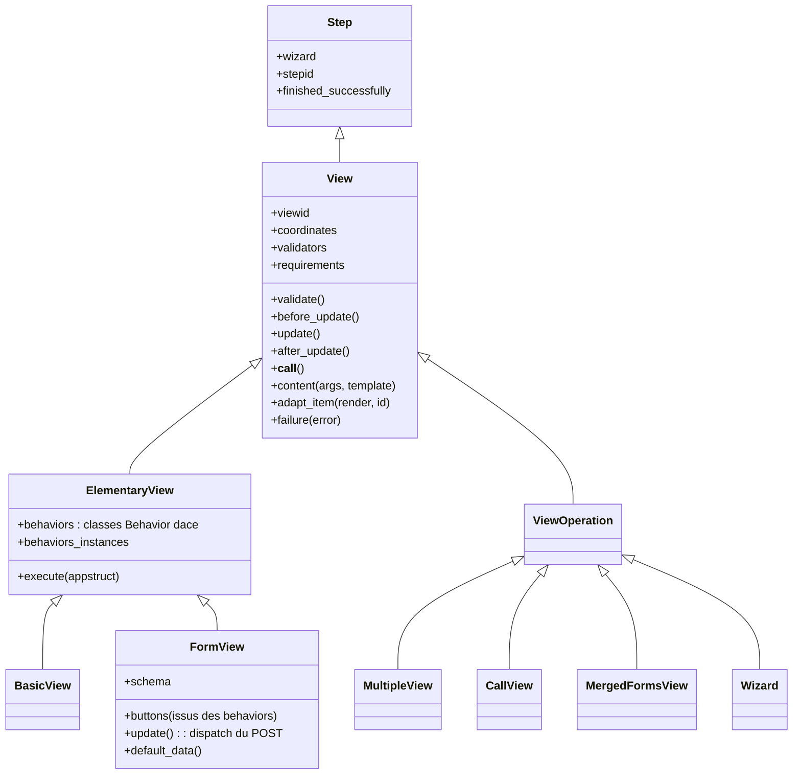
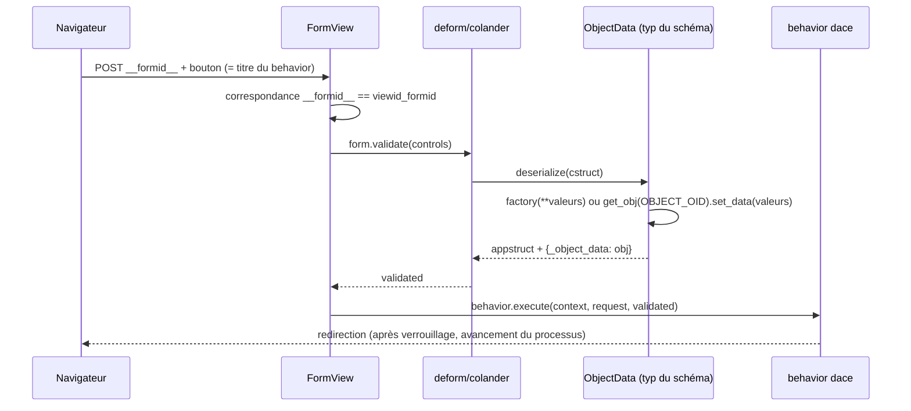

# Pontus — architecture et conception

*Document de conception, phase 2 de la feuille de route de modernisation. Décrit la couche **telle qu'elle est** dans la base legacy (ère Python 3.6). English version: [`../en/architecture.md`](../en/architecture.md).*

## 1. Ce qu'est Pontus

Pontus est la **couche de présentation de la pile dace** : elle transforme les actions métier dace en formulaires deform et en vues Pyramid, compose les vues en pages, et rend la navigation qu'un objet propose. Son idée fondatrice est le miroir de celle du moteur : *les boutons de soumission d'un formulaire sont les actions métier elles-mêmes*. Une `FormView` déclare un schéma et une liste de behaviors dace ; pontus instancie les behaviors (par la même découverte de catalogue que le moteur), génère **un bouton de soumission par instance de behavior**, valide le formulaire posté, et remet l'appstruct validé à `behavior.execute` — verrouillage, avancement du processus et redirection compris. Rien, dans l'application hôte, ne câble les boutons à la main.

La seconde idée fondatrice est le **contrat de résultat** : chaque vue rend `{'coordinates': {<emplacement>: [items]}, 'js_links': [...], 'css_links': [...]}` et les résultats se composent par fusion profonde (`util.merge_dicts`) — ce qui rend possible l'algèbre de composition de la section 4.

## 2. Les pièces

```mermaid
flowchart TB
    DACE["dace<br/>actions métier, validateurs, découverte par catalogue"]
    VIEW["pontus.view<br/>cycle de vie View, ElementaryView (behaviors), BasicView"]
    FORM["pontus.form<br/>FormView : un bouton de soumission par behavior"]
    SCHEMA["pontus.schema + pontus.file.ObjectData<br/>pont colander &#8596; objet du domaine, algèbre de schémas"]
    WIDGET["pontus.widget<br/>selects conscients des oids, séquences, fichiers/images, ressources"]
    OPS["pontus.view_operation<br/>MultipleView, CallView, MergedFormsView, Wizard"]
    NAV["pontus.index + pontus.panels<br/>page d'index et navbar depuis les actions"]
    HOST["Application hôte (nova-ideo)<br/>schémas + vues + DEFAULTMAPPING_ACTIONS_VIEWS"]

    HOST --> FORM
    HOST --> OPS
    NAV --> DACE
    VIEW --> DACE
    FORM --> VIEW
    FORM --> SCHEMA
    SCHEMA --> WIDGET
    OPS --> FORM
    OPS --> VIEW
```

## 3. Cycle de vie des vues et liaison aux behaviors

Mécanique ancrée dans le code :

- `View.__call__` enchaîne `validate → before_update → update → after_update` ; toute `ViewError` est rendue avec les messages par défaut (rédigés en français) de `pontus.resources` ; les `js_links`/`css_links` du résultat sont poussés sur la requête (`update_resources`).
- **Le `viewid` est compositionnel** : viewid du parent + nom propre + oid du contexte (+ oids des instances de behavior pour `ElementaryView`) — c'est ce qui désambiguïse plusieurs formulaires de la même classe sur une page, et ce contre quoi `has_id`/`__formid__` se comparent.
- `ElementaryView` résout ses `behaviors` (classes `Behavior` dace) via `get_instance` et, quand `validate_behaviors` est vrai, ajoute le `get_validator()` de chaque behavior aux validateurs de la vue : **une vue dont toutes les actions refusent le contexte/l'utilisateur lève `ViewError`** — pontus ne rend jamais un formulaire que le moteur rejetterait.
- `before_update` exécute `before_execution` sur chaque instance (le verrouillage dace), `execute(appstruct)` les exécute toutes.

## 4. Formulaires : l'aller-retour du POST

- Le type de schéma **`ObjectData`** (dans `pontus.file`) est le pont entre colander et le domaine : en mode *ajout* il instancie `factory(**valeurs_nettoyées)`, en mode *édition* il résout le nœud caché `__objectoid__` et appelle `set_data` — l'objet créé/édité voyage dans l'appstruct sous `_object_data`. Les nœuds marqués `to_omit`/`private` (csrf, ids, champs omis) sont nettoyés avant que l'objet ne voie les valeurs. C'est de là que vient l'omniprésent `appstruct['_object_data']` de nova-ideo.
- `Cancel` (dans `default_behavior`) court-circuite la validation du formulaire, exécute `cancel_execution` sur les behaviors frères (déverrouillage) et redirige vers l'index.
- Les hooks d'échec sont par bouton : `<titre du bouton>_failure`, avec repli sur le re-rendu du formulaire avec erreurs.
- `chmod = [('champ', 'r'), ...]` rend certains nœuds en lecture seule ; `FileUploadTempStore` ajoute les URL de prévisualisation et le nettoyage des fichiers temporaires d'upload.

## 5. L'algèbre de composition (`view_operation`)

Toutes les opérations partagent les attributs de classe `views`/`contexts` (valeurs ou callables) et se composent via le contrat de résultat :

- **`MultipleView`** — plusieurs vues sur un contexte ; les tuples imbriqués `(titre, [vues])` construisent des sous-multiple-views ; `isexecutable` se propage depuis les enfants, le premier enfant exécutable achevé avec succès court-circuite vers `success` ; exactement un item reste *actif* par emplacement (les onglets de nova-ideo).
- **`CallView`** — une classe de vue sur plusieurs contextes, agrégée (accordéon) par emplacement.
- **`MergedFormsView`** — *un seul* formulaire sur plusieurs contextes : l'opération clone le schéma de la sous-vue dans un nœud séquence `views` (une entrée par contexte, `context_oid`/`id` cachés), suffixe les boutons (« Publier **All** »), et à la soumission distribue chaque entrée validée au behavior de la sous-forme correspondante.
- **`CallSelectedContextsViews`** — le motif de traitement par lot : un widget à cases sur les contextes candidats plus un bouton par opération ; route vers `CallView` ou `MergedFormsView` selon que la vue cible est un formulaire, en faisant transiter la sélection par les nœuds cachés `__viewid__`/`__contextsoids__`.
- **`Wizard`** — un graphe d'étapes de vues, miroir du `Wizard` de niveau behavior de dace : mêmes tuples de transitions `(source, cible[, isdefault[, condition]])`, et une transition d'interface ne se valide que si la transition correspondante *du behavior* se valide aussi. L'étape courante vit en session (`__stepid__<viewid>`) ; des nœuds start/end synthétiques sont ajoutés ; une barre de progression est calculée par comptage de plus court chemin.

## 6. Index, navbar et le mapping action→vue

La liaison *classe d'action → classe de vue* est déclarée par l'**application hôte** dans `dace.processinstance.core.DEFAULTMAPPING_ACTIONS_VIEWS` ; `action.action_view` la lit. Par-dessus :

- **`Index`** (le `@@index` de tout `IObject`) collecte les actions du contexte marquées `isautomatic` et compose leurs vues en `MultipleView` : *au sens de pontus, « automatique » signifie « fait partie de la page d'index de l'objet »*.
- **`NavBarPanel`** rend les actions non automatiques et non `access_controled` de `context.actions`, séparées *start* (work-items de départ virtuels) / *actives*, groupées selon la hiérarchie `groups` des définitions d'actions.
- **`BreadcrumbsPanel`** remonte la lignée (masquée aux anonymes).

## 7. Widgets, fichiers, algèbre de schémas

- Les **widgets select/checkbox/radio de pontus sont conscients des oids** : ils sérialisent les objets du domaine en chaînes d'oids et désérialisent les oids en objets (`get_obj`) — les schémas manipulent de vrais objets, jamais des identifiants. `Select2Widget`/`AjaxSelect2Widget` ajoutent la machinerie select2 ; le registre de ressources câble tinymce, select2, cropper, fileinput.
- `SequenceWidget` porte un correctif historique (références faibles au parent sur les items clonés) et des oids stables pour les tests automatisés ; `TableWidget`/`AccordionWidget`/`LineWidget` en sont les variantes de mise en page.
- **`File`/`Image`** marient `dace.Object` et le fichier blob substanced ; `generate_variants` produit le jeu de vignettes d'`IMAGES_FORMATS` (`big`, `xlarge`, `large`, `medium`, `small`, `profil`), chacune accessible comme attribut (`photo.medium`) ; `Image` ajoute la zone d'intérêt du recadrage (`x`, `y`, `r`, `area_*`) postée par le widget cropper.
- Algèbre de schémas : `select(schema, mask)` / `omit(schema, mask)` (récursives, conscientes des séquences), `flatten`, `schemes_sum` — les outils avec lesquels nova-ideo dérive ses formulaires d'édition des schémas de contenu.

## 8. Carte de lecture

| Pour comprendre… | Lire |
|---|---|
| le cycle de vie et la liaison aux behaviors | `view.py` |
| l'aller-retour du POST | `form.py`, `file/__init__.py` (`ObjectData`) |
| l'algèbre de composition | `view_operation.py` |
| index et navigation | `index.py`, `panels.py` |
| widgets conscients des oids et ressources | `widget.py` |
| fichiers, images, variantes | `file/` |
| dérivation de schémas | `schema.py` |
